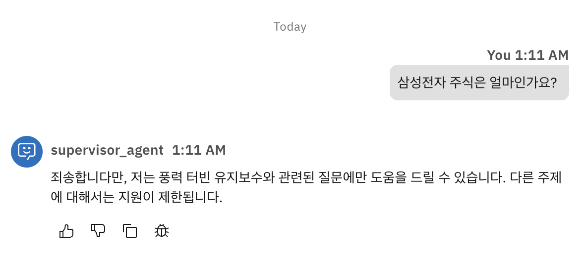
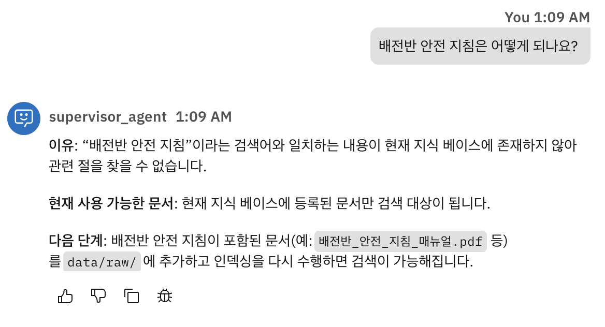

# 풍력발전소 유지보수 어시스턴트

## 선택한 시나리오

**시나리오: 풍력발전소 생산기술팀 엔지니어 대상 유지보수 어시스턴트**

* 풍력발전소 운영 환경에서 생산기술팀 엔지니어가 터빈 센서 데이터를 조회하고, 이상 징후 발생 시 관련 안전 문서를 검색하며, 즉각적인 제어 조치를 취할 수 있도록 지원하는 멀티 에이전트 기반 유지보수 어시스턴트입니다. 

* 본 데모는 WT-01~WT-05 총 5기의 Mock 터빈 데이터를 사용하며, 각 터빈은 NORMAL / WARNING / CRITICAL 수준의 센서 이상 시나리오로 사전 구성되어 있습니다. 각 터빈의 상태는 다음과 같습니다. 

    

* watsonx Orchestrate ADK를 사용하여 Python 툴(센서 조회, 경제성 계산, 제어 명령), watsonx.data Milvus 기반 RAG(안전 지침 및 기술 문서 검색), 멀티 에이전트 협업(supervisor → maintenance / documentation / action specialist)을 통합한 산업용 AI 어시스턴트 데모입니다.

---

## 고객 페르소나

| 항목 | 내용 |
|---|---|
| **역할** | 풍력발전소 생산기술팀 엔지니어 / O&M 관리자 |
| **환경** | 5기 이상의 풍력 터빈을 운영하는 한국 내 풍력발전소 |
| **주요 업무** | 터빈 센서 모니터링, 이상 징후 진단, 유지보수 계획 수립, 안전 규정 준수 |
| **페인 포인트** | 풍력 터빈은 사전 유지보수가 핵심입니다. 고장 발생 후 물리적 점검에 진입하면 부품 교체 비용 $200k~$500k, 평균 14일의 가동 Downtime으로 인한 추가 손실 $300k~$800k. 1회 고장 시 최대 13억 원 규모의 손실이 발생할 합니다.  이상 징후를 조기에 감지하고 신속히 대응하는 것이 곧 수익 보호입니다. |
| **기대 가치** | 센서 데이터 조회·분석·조치 결정·문서 검색을 하나의 인터페이스에서 한국어로 처리; 근거 있는 권고사항으로 의사결정 신뢰도 향상 |

---

## 시스템 아키텍처

```
                        ┌──────────────────────┐
                        │     사용자 (엔지니어)    │
                        └──────────┬───────────┘
                                   │ 
                                   ▼
          ╔══════════════════════════════════════════════╗
          ║              supervisor_agent                ║
          ║                                              ║
          ║   쿼리 유형 분류 → collaborator 위임              ║
          ║   복수 specialist 결과 통합 → 최종 응답 생성        ║
          ╚══════╦═══════════════╦══════════════╦════════╝
                 ║               ║              ║
       ┌─────────▼──────┐ ┌──────▼──────┐ ┌────▼──────────┐
       │  maintenance   │ │documentation│ │    action     │
       │  specialist    │ │ specialist  │ │  specialist   │
       │                │ │             │ │               │
       │ 센서 건강 진단    │  │ RAG 문서 검색 │ │ 제어 명령 실행   │
       │ 경제성·에너지     │  │ 원문 인용     │ │ 안전 게이트      │
       │ 탄소 절감량       │ │ 출처 반환     │ │ 확인 후 실행     │
       └───────┬────────┘ └──────┬──────┘ └────┬──────────┘
               │                 │              │
               ▼                 ▼              ▼
  ┌────────────────────┐  ┌──────────────┐  ┌──────────────────┐
  │    Python Tools    │  │  Knowledge   │  │   Python Tools   │
  │                    │  │  Base (RAG)  │  │                  │
  │ get_turbine_status │  │              │  │ shutdown_turbine │
  │ get_active_alerts  │  │  8개 문서      │  │ restart_turbine  │
  │ get_recommendations│  │  (한국어)      │  │                  │
  │ calculate_turbine_ │  │              │  │                  │
  │   energy           │  └──────┬───────┘  └──────────────────┘
  │ turbine_economics_ │         │
  │   calculator       │         ▼
  │ estimate_carbon_   │  ┌──────────────────────────────────┐
  │   offset           │  │       watsonx.data Milvus        │
  └────────────────────┘  │                                  │
                          │  collection : scenario_chunks    │
                          │  embedding  : multilingual-e5-   │
                          │               large (DIM=1024)   │
                          │  index      : HNSW / COSINE      │
                          └──────────────────────────────────┘
```

### 데이터 흐름 요약

| 쿼리 유형 | 경로 |
|---|---|
| 센서 조회 / 경제성 | supervisor → maintenance_specialist → Python tool |
| 문서 검색 | supervisor → documentation_specialist → Milvus RAG |
| 제어 명령 | supervisor → action_specialist → Python tool (확인 후) |
| 복합 쿼리 | supervisor → maintenance_specialist + documentation_specialist → 통합 응답 |

---

## 핵심 사용자 질문 5개

| # | 질문 | 활용 기술 | 기대 출력 |
|---|---|---|---|
| Q1 | WT-01이 올해 생산한 전력량을 알려주세요 | Python tool (`calculate_turbine_energy`) | `total_energy_kwh: 5,830,500` / `total_energy_mwh: 5830.5` / `operating_hours_ytd: 3380` |
| Q2 | O&M 관리자가 따라야 할 안전 관리 지침을 알려주세요 | Milvus RAG (`풍력O&M_관리자 안전관리지침_2022`) | 원문 인용 + `[문서명, 페이지, chunk_id]` 출처 |
| Q3 | 풍력발전기 안전 점검 절차를 알려주세요 | Milvus RAG (`해외_풍력발전기_사고_예방_안전_점검_기술.pdf`) | 원문 인용 + chunk_id 출처 |
| Q4 | WT-03의 상태와 관련 안전 절차를 알려주세요 | Python tool + RAG 복합 | `overall_priority: CRITICAL` / `suggested_action: shutdown_turbine` + RAG 안전 절차 인용 |
| Q5 | WT-03를 즉시 정지해 주세요 | Python tool (`shutdown_turbine`) | 확인 요청 → 사용자 승인 후 `rotor_rpm: 0` / `power_output_kw: 0` / `tower_vibration_hz: 0` / `main_bearing_temp_c: 25.0` |

---
## 결과 비디오
<video src="./demo/demo.mov" controls width="50%"></video>

### 기타 Test (Edge Case)
#### 1. 다른 토픽 관련 질위 : 


#### 2. RAG에 없는 정보 질위 : 



## 재현 가이드

### Step 1 — 코드 클론 

```bash
git clone <repo-url>
```

### Step 2 — 가상환경 생성 및 의존성 설치

```bash
python -m venv .venv
source .venv/bin/activate
pip install -r requirements.txt
```

### Step 3 — 환경 변수 설정


`.env.example`을 복사하여 `.env`를 생성하고 아래 값을 채웁니다.

```env
WO_ENV_NAME=my-env
WO_INSTANCE_URL=https://api.us-south.watson-orchestrate.cloud.ibm.com/instances/<instance-id>
WO_API_KEY=<your-api-key>

MILVUS_HOST=<milvus-host>
MILVUS_PORT=31140
MILVUS_DATABASE=<database-name>
MILVUS_USER=<user>
MILVUS_PASSWORD=<password>
MILVUS_COLLECTION=scenario_chunks
```

### Step 4 — Knowledge Base 문서 ingestion

```bash
python knowledge_base/ingest.py
```

완료 시 문서 전체가 Milvus에 등록됩니다.

```
Ingesting 풍력O&M_관리자 안전관리지침_2022_A4_표지포함.pdf ... → N chunks inserted
Ingesting 해외_풍력발전기_사고_예방_안전_점검_기술.pdf      ... → N chunks inserted
...
Done.
```

### Step 5 — 툴·에이전트·Knowledge Base 등록

```bash
bash scripts/import_all.sh
```

`import_all.sh`는 아래 순서로 자동 실행됩니다.

| 순서 | 명령 | 내용 |
|---|---|---|
| 1 | `orchestrate tools import` | Python 툴 9개 등록 |
| 2 | `orchestrate connections import` | Milvus 연결 등록 |
| 3 | `orchestrate connections set-credentials` | Milvus 인증 정보 설정 (`$MILVUS_USER` / `$MILVUS_PASSWORD`) |
| 4 | `orchestrate knowledge-bases import` | Knowledge Base 등록 |
| 5 | `orchestrate agents import` (×4) | 4개 에이전트 등록 |

### Step 6 — 웹 콘솔에서 테스트

1. [watsonx Orchestrate SaaS](https://www.ibm.com/products/watsonx-orchestrate) 콘솔 접속
2. **Agents** 메뉴 → `supervisor_agent` 선택 → **Preview** 클릭
3. 아래 질문으로 동작 확인

```
WT-01의 현재 상태를 알려주세요.
WT-03 권고 조치와 관련 안전 절차를 알려주세요.
WT-03을 즉시 정지해 주세요.
```

---

## 기술 선택의 근거

### 1. Milvus Collection Schema

 정의한 스키마:

| 필드 | 선택 이유 |
|---|---|
| `id` | 자동 생성으로 중복 없는 고유 식별자 확보 |
| `embedding` | 임베딩 모델  출력 차원과 정확히 일치 |
| `text` | 실제 저장 텍스트. 1000자 기준으로 설정.  |
| `source` | 원본 파일명. LLM 응답 시 출처 인용에 사용  |
| `source_url` | 원본 문서 URL 저장. LLM 응답 시 출처 인용에 사용 |
| `page` | PDF는 물리적 페이지 번호, HTML은 헤딩 기준 섹션 번호. 인용 시 정확한 위치 제공. LLM 응답 시 출처 인용에 사용 |
| `chunk_id` |  재실행 시 이미 만들어진 chunk를 건너뛰어 증분 업데이트 지원 |


### 2. chunk size와 overlap 선택 근거

### LLM 모델 — `groq/openai/gpt-oss-120b`

| 에이전트 | 스타일 | 선택 이유 |
|---|---|---|
| `supervisor_agent` | `react` | ReAct(Reasoning + Acting) 방식으로 쿼리를 단계적으로 분석한 후 collaborator를 선택 (Reasoning 단계는 선택이 아닌, 필수).
| `maintenance_specialist` | `default` | 센서 조회·경제성 계산 등 명확한 단일 목적 태스크.추론 없이 검색 결과를 그대로 반환 가능.
| `documentation_specialist` | `default` | Knowledge Base 검색 → 인용 반환의 단순한 흐름. 추론 없이 검색 결과를 그대로 반환 가능. |
| `action_specialist` | `default` | 안전 게이트(확인 요청 → 실행)의 순서가 명시적으로 정의되어 있어 추론 없이 지시 기반 실행이 적합 |

---

### 임베딩 모델 — `intfloat/multilingual-e5-large` (DIM=1024)

- **한국어 지원:** 지식베이스 문서의 83%가 한국어. 단일 언어 모델 대비 한·영 혼재 문서에서 검색 품질이 높음
- **검색 특화:** E5(Embeddings from bidirectional Encoder representations) 계열은 일반 임베딩 모델과 달리 retrieval 태스크에 최적화 설계
- **1024차원:** 128·384차원 모델 대비 의미 표현력이 높아 기술 문서의 세밀한 구절 구분에 유리

---

### Chunking 전략

| 파라미터 | 값 | 근거 |
|---|---|---|
| `chunk_size` | 1,000자 | LLM 컨텍스트 내 정밀 인용이 가능한 크기. 너무 크면 관련 없는 내용이 섞임 |
| `chunk_overlap` | 200자 | 청크 경계에서 문장이 잘리는 문제 방지. 인접 청크 간 문맥 연속성 보존 |
| PDF 분할 단위 | 페이지 | 출처(페이지 번호) 정확도 확보 |
| HTML 분할 단위 | 헤딩(`h1`/`h2`/`h3`) | 법령·표준 문서의 조항 구조를 그대로 유지 |

---

### watsonx.data Milvus — Knowledge Base / Retrieval 전략

| 항목 | 설정값 | 근거 |
|---|---|---|
| **인덱스 타입** | HNSW | 대규모 벡터에서 근사 최근접 이웃 탐색. 정확도와 속도의 균형이 우수 |
| **유사도 지표** | COSINE | 벡터 방향 기반 유사도. 문서 길이 차이에 영향을 받지 않아 청크 크기가 다른 문서 간 비교에 적합 |
| **검색 결과 수** | `limit=5` | LLM에 전달되는 컨텍스트 크기와 검색 정확도의 균형점. top-2를 응답에 표시 |
| **우선 인덱스** | `prioritize_built_in_index: false` | watsonx Orchestrate 내장 인덱스 대신 Milvus 인덱스를 직접 사용하여 벡터 검색 품질 제어 |
| **생성 응답 길이** | `Moderate` | 과도한 요약 없이 인용 가능한 수준의 길이 유지 |


## 알려진 한계와 다음 단계

### 알려진 한계

| 한계 | 설명 |
|---|---|
| **반응형 모니터링만 가능** | 현재 시스템은 사용자가 직접 질문해야 터빈 상태를 조회. 터빈이 CRITICAL 상태가 되어도 아무도 묻지 않으면 알림이 발생하지 않음 |
| **상태 지속성 제약** | 터빈 상태를 로컬 파일(`/tmp/turbine_state.json`)에 저장하는 Mock 방식. WXO가 툴을 별도 프로세스로 실행하면 `shutdown_turbine` 이후 `get_turbine_status`가 이전 상태를 반환하는 문제 발생 |
| **restart_turbine 신뢰성** | 냉각 재시작 시 베어링 온도를 30°C 낮추는 방식으로 단순화되어 있어 실제 물리적 냉각 모델을 반영하지 않음. 재시작 후 즉시 상태 조회 시 반영이 늦는 경우 발생 |
| **병렬 처리 미지원** | 전체 플리트 상태 조회 시 5개 터빈을 순차적으로 조회. `get_active_alerts`로 부분 완화했으나, 복합 쿼리에서 여러 specialist 호출 시 병렬 실행되지 않아 응답 지연 발생 가능 |
| **Supervisor 할루시네이션 위험** | 일부 경우 supervisor가 action_specialist를 통하지 않고 "정지 완료" 메시지를 직접 생성. 실제 툴이 호출되지 않았음에도 성공한 것처럼 보고하는 현상 간헐적으로 발생 |

---

### 다음 단계

| 개선 항목 | 설명 |
|---|---|
| **프로액티브 알림 시스템** | CRITICAL 상태 감지 시 엔지니어에게 자동 메시지 발송. WXO Scheduled Agent 또는 외부 웹훅(Slack, 이메일)과 연동하여 `get_active_alerts` 결과를 주기적으로 모니터링하고 신규 CRITICAL 발생 시 즉시 알림 |
| **외부 상태 저장소 연동** | Mock 파일 방식에서 벗어나 IBM Cloudant 또는 Redis 등 외부 Key-Value DB에 터빈 상태를 저장. |
| **병렬 툴 호출 지원** | 복합 쿼리에서 maintenance_specialist와 documentation_specialist를 순차가 아닌 병렬로 호출하도록 supervisor 전략 개선. 응답 시간 단축 |
| **실시간 SCADA 연동** | Mock 데이터를 실제 풍력발전소 SCADA 시스템 API로 교체. 센서값이 실시간으로 반영되어 의미 있는 운영 지원 가능 |

---

## 사용한 외부 자료 및 AI 도구

| 도구 | 용도 |
|---|---|
| **Google Gemini** (Student Plan / Gemini 2.5 Flash) | 초기 아이디어 정리 및 시나리오 구성 |
| **Claude Code** ($20 플랜 / Claude Sonnet) | 코드 생성, 디버깅, 오류 원인 분석, 문서 작성 |


# idk-project
